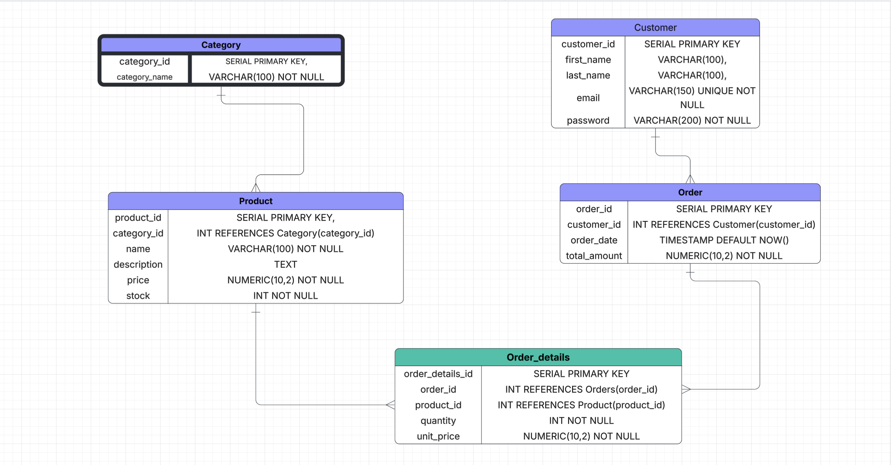

# 🛒 E-Commerce Platform

A simple and efficient **E-Commerce system** designed to help people **find and buy products easily**.  
The platform organizes products into categories, allows customers to browse items, and supports placing orders smoothly.

---

## ✨ Overview

This project represents a basic backend structure for an online store.  
It provides essential features for any e-commerce application:

- Browse products within categories  
- View product details (name, description, price, stock)  
- Register customers  
- Create orders  
- Store detailed order items  

---

## 🎯 Purpose

The main goal of this project is to:

- Help users easily **find anything they need**  
- Provide a simple and clean database model  
- Give developers a solid starting point for building a real e-commerce platform  

---

## 🗄️ Database Schema

The system uses a relational database (PostgreSQL) containing the following tables:

- **Category** — Product categories  
- **Product** — Item details  
- **Customer** — Customer information  
- **Orders** — Order records  
- **OrderItem** — The products included in each order  

---

## 📌 Features

- Organized product structure  
- Customer management  
- Order creation  
- Scalable database design  

---
## 🗺️ ERD Diagram

The following Entity Relationship Diagram (ERD) represents the database structure of the E-Commerce system.  
It illustrates the main entities and the relationships between them, including categories, products, customers, orders, and order details.

### **📌 ERD Overview**
- **Category → Product**: One category can have many products.  
- **Customer → Orders**: One customer can place multiple orders.  
- **Order → Order_details**: Each order contains multiple order items.  
- **Product → Order_details**: A product can appear in multiple order items.

### **📷 ERD Diagram**

